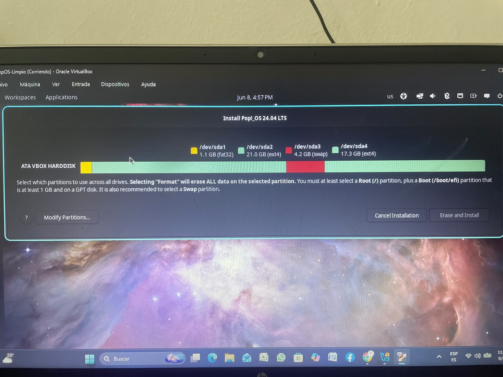

# 🚀 Proyecto Final - Sistemas Operativos (750001C)
*Universidad del Valle • Semestre 1-2026*

### 👥 Información del Equipo
* *Grupo:* Grupo 5
* *Integrante:*
  * [Julian Andres Patino Correa] - [2553861]

### 📊 Especificaciones del Entorno asignado
* *Distribución Gráfica:* Pop!_OS
* *Distribución Consola (Contenedores):* Rocky Linux 9.8
* *Imagen Base de Docker:* rockylinux:9

---
## 🖥️ Componente 1: Configuración del Entorno Virtual

En esta fase inicial se realizó el aprovisionamiento y la configuración del entorno hipervisor utilizando *VirtualBox* para desplegar la distribución gráfica asignada al equipo.

### ⚙️ Especificaciones de la Máquina Virtual:
* *Sistema Operativo Anfitrión:* Windows 11 pro
* *Sistema Operativo Invitado (Asignado):* Pop!_OS 
* *Memoria RAM Asignada:* 4096 MB (4 GB)
* *Procesadores (vCPUs):* 2 Cores
* *Almacenamiento Virtual:* 25 GB - 40 GB (Dinámicamente asignado)

### 📊 Comandos de Diagnóstico del Sistema Operativo:
Para validar la correcta instalación y los recursos del sistema desde la terminal de Pop!_OS, se ejecutaron los siguientes comandos:

1. *Verificación de la Distribución y Versión:*

#ip a, ssh , lsblk, cat /etc/os-release
---

## 🐳 Componente 2: Contenedores Docker

En esta fase se construyó una arquitectura multicontenedor utilizando Docker Compose, implementando un servidor web Nginx para el Frontend y un script en Python para el Backend, ambos corriendo sobre imágenes de Rocky Linux 9.

### 📸 Evidencias de Ejecución:
1. *Compilación del entorno:*
   
   (Aquí poner la captura del comando docker compose up -d --build funcionando).

2. *Verificación del Frontend (Nginx):*
   
   (Aquí poner la captura del navegador en http://localhost o el resultado del curl http://localhost).

3. *Verificación del Backend (Python JSON):*
   
   (Aquí poner la captura del curl http://localhost:5000 donde responde el JSON).

---

## ☸️ Componente 3: Orquestación con Kubernetes (Minikube)

Se migró y orquestó el servicio de Nginx utilizando un clúster local de Kubernetes con Minikube, demostrando la escalabilidad horizontal y la alta disponibilidad del entorno.

### 📸 Evidencias de Ejecución:
1. *Despliegue Inicial (2 Réplicas):*
   
   (Aquí va la captura de los comandos kubectl get pods y kubectl get svc con el puerto 30080).

2. *Acceso mediante el servicio NodePort:*
   
   (Aquí va la captura del navegador web cargando la URL generada por minikube service nginx --url).

3. *Escalabilidad Horizontal Activa (3 Réplicas):*
   
   (Aquí va la captura de la terminal mostrando las 3 filas de Pods en ejecución tras el comando scale).

---

## 🧠 Conclusiones Técnicas y Lecciones Aprendidas

1. *Gestión de Entornos RedHat/Fedora:* El uso de la imagen base rockylinux:9 exigió cambiar los flujos de trabajo tradicionales de Debian/Ubuntu (apt) hacia el gestor de paquetes dnf. Además, se comprendió la importancia de las rutas de configuración nativas, mapeando los volúmenes del Frontend estrictamente en /usr/share/nginx/html.
2. *Sensibilidad de Sintaxis en Python:* Durante el desarrollo del backend se enfrentaron errores críticos de indentación (IndentationError) y de orden de parámetros posicionales (SyntaxError), reforzando la necesidad de mantener un formateo limpio y estricto del código en entornos de producción.
3. *Orquestación en Capas:* Se evidenció la diferencia operativa entre Docker Compose (ideal para desarrollo local y acoplamiento simple) y Kubernetes/Minikube, el cual abstrae la infraestructura permitiendo escalamiento bajo demanda con un solo comando sin interrumpir el servicio.

---

## 🎬 Enlace del Video Demostrativo
[👉 Haz clic aquí para ver la sustentación en YouTube](PONER_ENLACE_AQUI)
